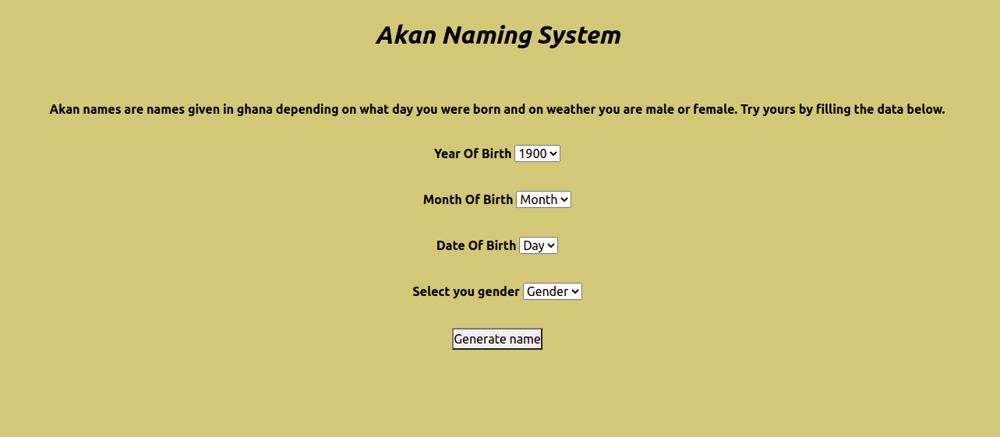

<h1>Akan naming App</h1>

This is a simple application that generates to you your Akan name.

<h2>Description</h2>

Akan naming system is a naming system that is originaly from Ghana, Africa. Akan names are given based on gender and also on the day of the week one was born.

Technically there is a total of 14 Akan names.

The following are male Akan names listen respectively from Sunday to Saturday;

<ul>
<li>Kwasi</li>
<li>Kwadwo</li>
<li>Kwabena</li>
<li>Kwaku</li>
<li>Yaw</li>
<li>Kofi</li>
<li>Kwame</li>
</ul>

The following are female ones listed respectvely from Sunday to Saturday

<ul>
<li>Akosua</li>
<li>Adwoa</li>
<li>Abeenaa</li>
<li>Akuna</li>
<li>Yaa</li>
<li>Afua</li>
<li>Ama</li>
</ul>

<h2>Installation</h2>

To open this webpage you are required to  copy this link https://blackcaleb.github.io/akan-naming-app/ into your browser.

<h2>Specifications</h2>

For this link to work the specifications are a browser application and also internet connection. This link doesnt require any special permissions to work.

<h2>Usage</h2>

Fill the required data and click on the 'generate' button.

<h2>Visuals</h2>

This is a screenshot of the webpage.

<h2>Contributing</h2>

n a case you have any issue with this project you can always pull a request at the pull request centre. In the near future we will be adding new content so keep in touch with us. This project is open to contributions. If one has any contributions you should state so in the pull request centre and we will reach to you.

We would like to acknowledge Moringaschool and also @JoshuaBarawa they contributed a lot in the complition of this project.

<h1>License</h1>

MIT License

Copyright (c)[2021][blackCaleb]
